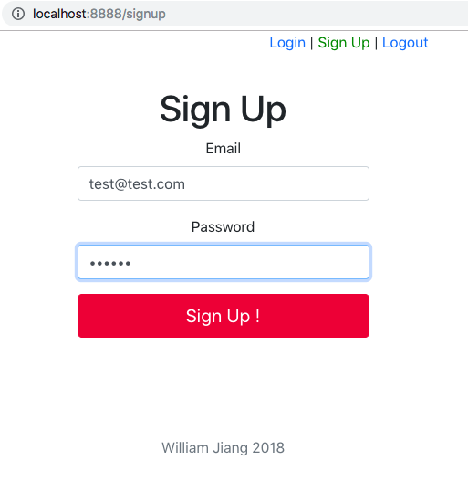
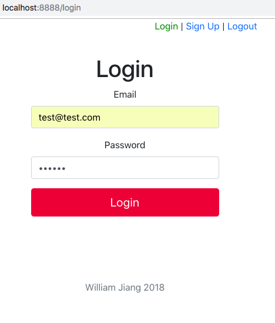
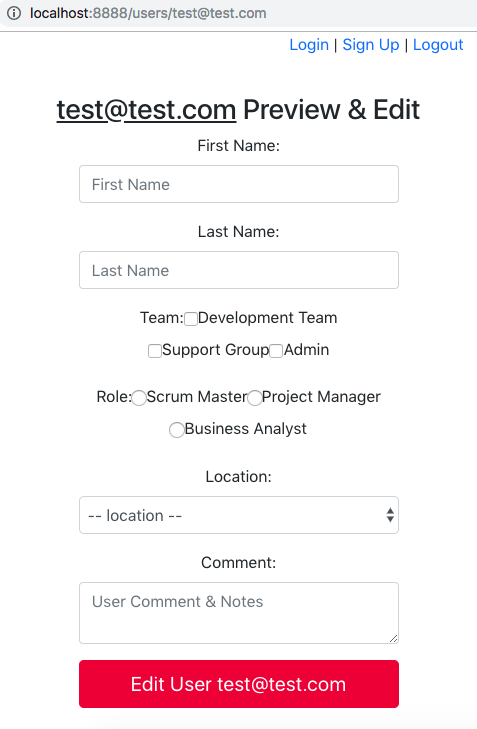
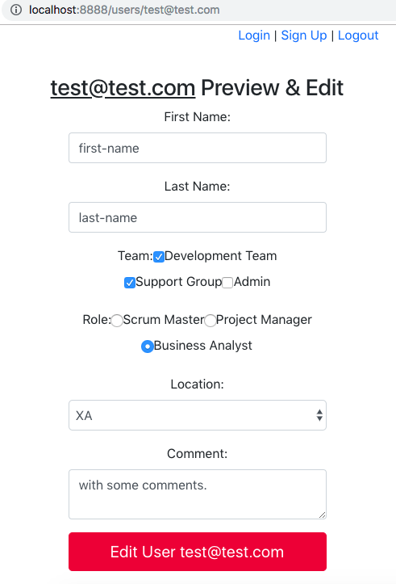
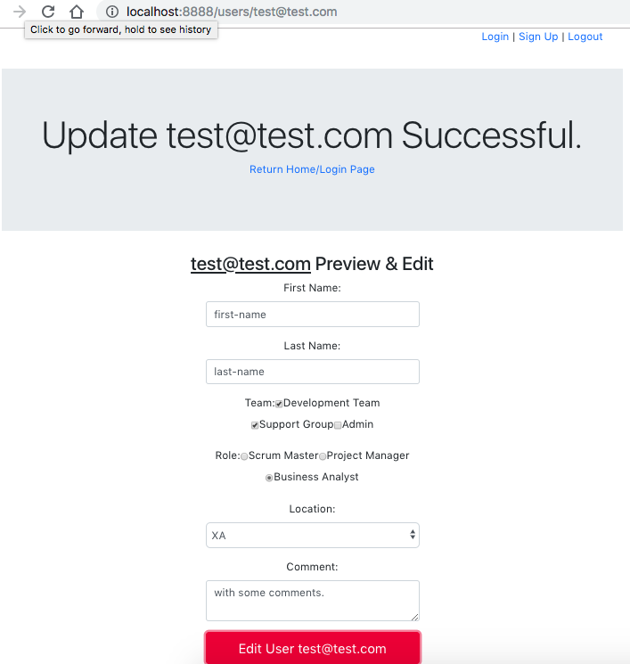
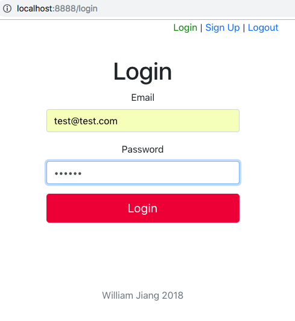
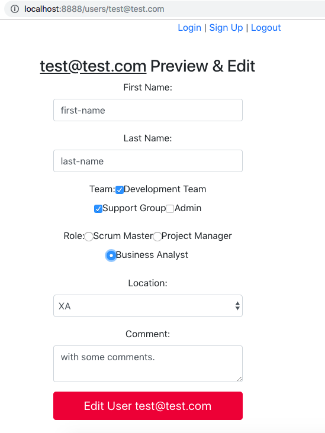

Quick Start
------------

```bash
$ git clone https://github.com/jxjwilliam/react-user-login.git
$ cd react-user-login
$ cd client
$ npm install
$ npm build
$ cd ..
$ npm install
$ npm run server
$ open localhost:8888/
```

Here it goes!

More Start
----------

```bash
$ mongod &
$ cd client && yarn start
$ npm run server
$ open localhost:3000/
```

or:
```bash
$ mongod &
$ npm run dev
$ open localhost:3000/
```

MERN fullstack technology
--------------------------

1. React.js
1. Node.js
1. Express.js
1. MongoDB + Mongoose


Frontend
---------

- React
- Redux (with redux-thunk, redux-logger)
- react-router-dom
- react-bootstrap
- react form: with the form fields:
  1. input (email, password)
  1. checkbox
  1. radio
  1. select
  1. textarea
- Form validation

Backend
---------

- jwt token
- bcrypt
- routers
- express.js

Features
---------

- full-stack Solution 
- React
- Redux
- react-router
- sorting
- field filter
- search (debounce)
- pagination
- JWT token
- redux-form with CRUD
- redux-thunk for Ajax
- redux-logger with Redux-debugger
- Node.js + Express.js (web-server)
- MongoDB
- fontawesome (webFont)
- Restful APIs
- react-model
- Heroku cloud service
- built production version


APIs
----

1. /api/signup
1. /api/login
1. /api/users/:email
1. /api/logout
1. /api/users


DB Schema
-----------

- mongoose schema:

```javascript
{
  email: {
    type: String,
    required: true
  },
  password: {
    type: String,
    required: true
  },
  firstName: String,
  lastName: String,
  role: String,
  team: [String],
  comment: String,
  location: String,
  timestamp: {
    type: Date,
    default: Date.now()
  }
}
```

Scaffolders
------------

1. create-react-app
1. express-cli

Screenshots
------------

The following are the screenshots with the sequences:

1. Signup to create a user



2. Login with this created user



3. Entry of Edit screen



4. Edit the Form



5. Submit the Form



6. Re login this user



7. check the data persistance



